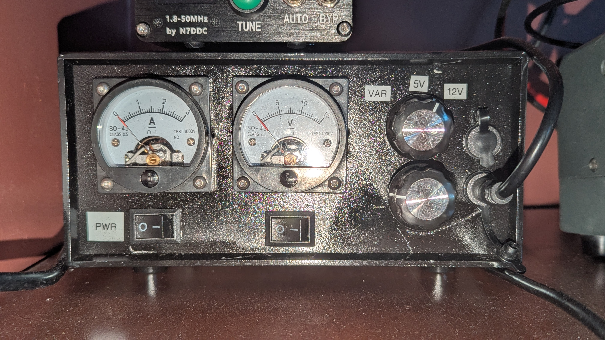

# Linear Power Supply

A linear power supply for my amateur radio experiments. This power supply features two outputs (both at the same voltage). A selector knob allows you to select from 2 presets (which I've used for 12 and 5V) and variable voltage.

PLEASE NOTE: the work in this repository is not fully documented.

# Linear?

Linear power supplies are "quiet" from an RF perspective. This is ideal when your trying to listen to a distant radio station and don't want to add to the noise floor.

# Status

This project has been completed and the power supply is being used. I simply haven't had the time to update this repository with further information as yet.

